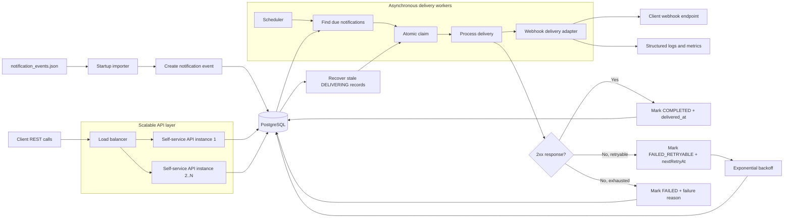

# Notification Service

Spring Boot project for asynchronous webhook delivery and a self-service notification events API.

## System design



The service loads source events at startup, persists them as notification delivery records, exposes a self-service API for querying and replaying them, and processes webhook delivery asynchronously with retries backed by PostgreSQL. Scalability comes from stateless API instances and decoupled background workers, while resiliency comes from persisted delivery state, atomic claims, exponential backoff, stale-delivery recovery, and near real-time logs and metrics.

## Local development

Start PostgreSQL:

```bash
docker compose up -d postgres
```

Note: Docker Desktop must be running before the compose command can start the PostgreSQL container.

Run the application:

```bash
mvn spring-boot:run -Dspring-boot.run.profiles=local
```

If `mvn` is not available on your PATH, you can use the IntelliJ-bundled Maven:

```powershell
& "C:\Program Files\JetBrains\IntelliJ IDEA 2025.3.2\plugins\maven\lib\maven3\bin\mvn.cmd" spring-boot:run "-Dspring-boot.run.profiles=local"
```

## Manual testing

### Startup behavior

At application startup, the service loads `notification_events.json` and creates notification records only for events that have a matching seeded subscription.

With the current demo seed data, these notification events should exist after startup:

- `EVT001`
- `EVT002`
- `EVT003`
- `EVT004`
- `EVT005`

### Demo client identity

All API requests must include the `X-Client-Id` header.

Examples:

- `CLIENT001`
- `CLIENT002`
- `CLIENT003`

### List notification events

```bash
curl -H "X-Client-Id: CLIENT001" http://localhost:8080/notification_events
```

### Get a single notification event

```bash
curl -H "X-Client-Id: CLIENT001" http://localhost:8080/notification_events/EVT001
```

### Filter by delivery status

```bash
curl -H "X-Client-Id: CLIENT001" "http://localhost:8080/notification_events?delivery_status=FAILED"
```

### Filter by event creation date

```bash
curl -H "X-Client-Id: CLIENT001" "http://localhost:8080/notification_events?from_event_created_at=2024-03-15T00:00:00Z&to_event_created_at=2024-03-15T23:59:59Z"
```

### Replay a failed notification event

Replay is only allowed when a notification event is in `FAILED` status.

```bash
curl -X POST -H "X-Client-Id: CLIENT002" http://localhost:8080/notification_events/EVT003/replay
```

Expected behavior:

- `202 Accepted` when replay is scheduled
- `409 Conflict` when the notification is not replayable
- `404 Not Found` when the notification does not belong to the caller

### How retries work

Retries are automatic. The scheduler polls for due notification events and sends them through the webhook delivery flow.

- scheduler class: `NotificationDeliveryScheduler`
- default poll interval: `5000` ms
- default retry backoff: exponential, starting at `30` seconds
- replay endpoint purpose: manual recovery after the automatic retry flow has already exhausted attempts and the event reached `FAILED`

So the normal behavior is:

- `PENDING` or `FAILED_RETRYABLE` events are picked up automatically
- retryable delivery errors move the event to `FAILED_RETRYABLE`
- exhausted retries move the event to `FAILED`
- `POST /notification_events/{id}/replay` is only for terminal failures

### Inspect the database

Open a `psql` session inside the PostgreSQL container:

```bash
docker exec -it notification-service-postgres psql -U notification_user -d notification_service
```

Check imported notification events:

```sql
select notification_event_id, client_id, event_type, delivery_status, attempt_count, http_status, final_failure_reason
from notification_events
order by notification_event_id;
```

Check seeded subscriptions:

```sql
select client_id, event_type, target_url, active
from subscriptions
order by client_id, event_type;
```

### Real webhook delivery testing

The seeded webhook URLs are placeholder `https://...example.com/...` addresses. To test real delivery behavior, update one subscription to a real public HTTPS endpoint that you control.

Example:

```sql
update subscriptions
set target_url = 'https://your-public-https-endpoint.example/webhook'
where client_id = 'CLIENT001'
  and event_type = 'credit_card_payment';
```

Then restart the application or replay a failed notification event.

### Webhook safety note

The current webhook adapter rejects:

- non-HTTPS URLs
- `localhost`
- `127.x.x.x`
- private network ranges such as `10.x.x.x`, `192.168.x.x`, and `172.16.x.x` to `172.31.x.x`

If you want to test against a local receiver, expose it through a public HTTPS tunnel first.
