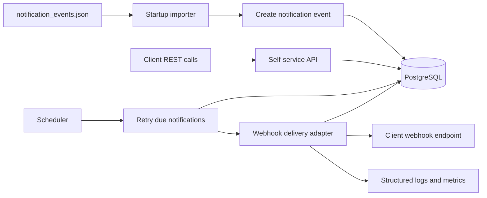

# Notification Service

Spring Boot project for asynchronous webhook delivery and a self-service notification events API.

## System design



The service loads source events at startup, persists them as notification delivery records, exposes a self-service API for querying and replaying them, and processes webhook delivery asynchronously with retries backed by PostgreSQL.

## Local development

Start PostgreSQL:

```bash
docker compose up -d postgres
```

Note: Docker Desktop must be running before the compose command can start the PostgreSQL container.

Run the application:

```bash
mvn spring-boot:run -Dspring-boot.run.profiles=local
```
